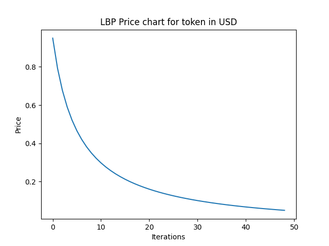
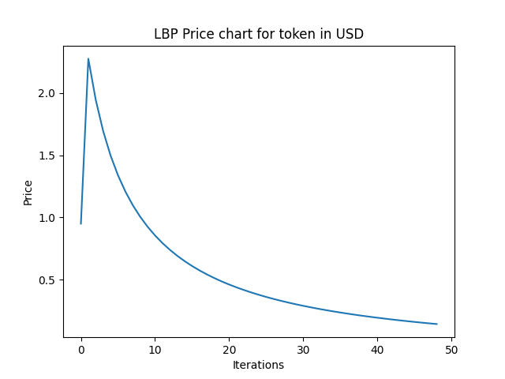
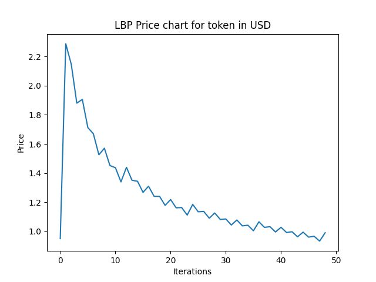
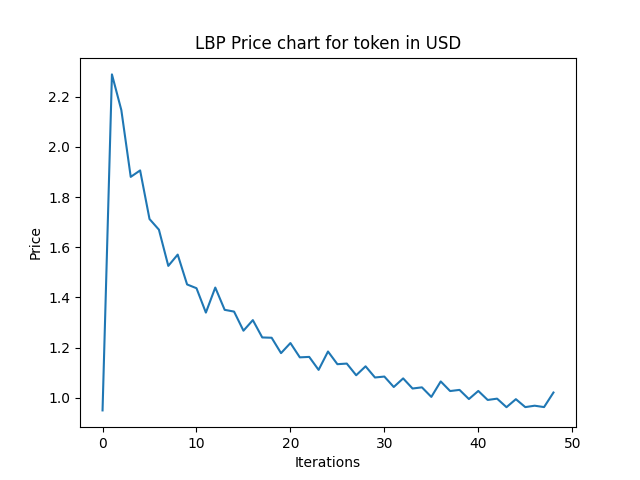

# lbp_sim
Quick-n-Dirty simulator for Balancer Liquidity Bootstrap Pools.

This project was written to test out some theories about using an LBP to sell Kylin. This project didn't exist 24 hours ago, so to say it's rough around the edges is an understatement! Treat it like a hackathon project and proceed with caution. If you encounter any bugs, please open an issue in this repo. Forks and PRs are encouraged!

## Quick Start

0. Check out this repo on your local machine
1. Ensure you have python 3 installed and matplotlib (for the charts)
2. run ```python runner.py configs/mix_of_everything.json```

That should load in the buyer strategies configured in the ["mix of everything" config](configs/mix_of_everything.json), define an LBP simulator using the default settings (which happen to be the Kylin parameters), run through 48 iterations, and then print the price history and plot a chart.

## Tweaking Things

[Runner.py](runner.py) is the script that runs things. There are a few things you can swap around:

* tweak the LBP pool configurations. Want to play with different weights, different weight deltas, different balances? Check out the LBP definition and it should be fairly simple to
* set the verbosity. If you want to see token sales play-by-play and how that affects the pool then set the ```verbose``` variable to ```True```.
* set the number of iterations. Default is 48, corresponding to a 48 hour sale. Each iteration causes a change in the weights (and prices) so if you do that every minute for a day then choose 60*24 iterations.
* toggle showing the matplotlib chart. Default is true but you can set ```show_chart=False``` if it's getting tedious to have a window popping up all the time.

## Defining Buyers

The sim assumes you will pass it a JSON config file defining a population of buyers with different strategies. There is one clear gotcha here to be aware of: **Every buyer will have a chance to "act" in every round, but they will always act in order. That means that if you define a bunch of greedy bots first they might pump up the price before anybody else gets to act and so the downstream buyers might change their strategy. This is mostly by design but it completely ignores the chaos of a real sale where speed matters.** Keep this fact in mind when defining a population. If you want to simulate a buyer acting more quickly than others, move it to the front of the list.

There are currently 4 defined buying strategies and we will discuss each in a bit of detail.

### Dollar-Cost Average

These buyers buy a fixed amount of USD at a fixed interval and they ignore the price (mostly). Sample json config:

```
{"count":300, "type":"DollarCostAverage","budget_per_buy":500,"frequency":2,  "ceiling": 3}

```

In that config, 300 buyers will be generated. Each of them will buy $500 (```budget_per_buy: 500```) in every 2nd iteration of the pool (```frequency: 2```). They also have the notion of a "ceiling" price, which is set to $3. If the price goes above there, they'll stop DCAing until it comes back down.

The frequency with which they buy is not terribly intuitive. It's a modulo operation, so if you set it to "1" they will buy in every iteration. "2" means every second iteration, "3" every third, and so on. This feels very brittle but I can't put my finger on why. Open an issue (or a PR) if you can see why this might be bad).

### All-In At Start (Bots)

These buyers are looking to buy one time, as early as possible. After their initial buy they basically ignore the market. Sample config:

```
{"count":100, "type":"AllInAtStart","budget":1000, "ceiling": 4}

```

That defines 100 bots, each of which will buy $1000 of the token in the first iteration. There is also a ceiling as a safeguard in case the price goes too high, in which case they will buy as soon as the price drops and then stop.

This is a pretty simplistic behaviour. Feel free to add more bot definitions!

### Target Buyer

These buyers have a price they consider fair and are watching until it drops to that point before they buy. They have a fixed budget and are looking to buy once so they will ignore the market once they succeed. Sample config:

```
{"count":10, "type":"TargetBuyer","target":0.5,"budget":100000}
```

This produces 10 TargetBuyers, each of which has decided that $0.50 is a fair price and when it gets there they're going to throw $100,000 at the market. In all likelihood, the first of the 10 to act will ruin it for the next 9 by pumping the price, so it's quite an interesting pattern.


### FOMO Buyer

These guys are essentially the same as the Target Buyers but they also have a point at which they will panic-buy if the price goes too high. Sample config:

```
{"count":1000, "type":"FOMOBuyer","target_high":2,"target_low":0.6,"budget":10000,  "ceiling": 2}
```

This gives us 100 FOMO-susceptible Target Buyers. They think $0.60 is a fair price and they are willing to buy $10,000 at that point, but they will also FOMO in if the price goes above $2. Their budget doesn't change.

There's a lot to be said for making this a more interesting strategy by saying half the budget buys at FOMO levels and the rest is held in reserve for a drop (potentially resetting the target price). 

### Define Your Own

There is a [buyers](buyers) directory which includes a class for each strategy. I'm a Java programmer and threw this together in python and tied myself in knots trying to get the OO to work right here, so there just isn't OO and everything is based on duck-typing in the least safe possible way. Proceed with caution!

If you pick one of the existing strategies you can see they implement an ```act``` method, which receives the LBP object. They can use that to query the price and then decide whether to buy, and how much, according to their own logic. Should be pretty easy to add your own. Just remember to add it to the Factory class so the json config picks it up. If my serialization makes your eyes bleed then please submit a PR to fix it!

## Defining a Set Of Buyers

Things get chaotic fast, so start simple. Let's start with a blank slate in our ```config.json```:

```
[ ]
```
 That should give us a look at what happens if nobody does anything and the price declines to $0.05.


So let's add in some bots:

```
[
      {"count":100, "type":"AllInAtStart","budget":1000, "ceiling": 4},
      {"count":2, "type":"AllInAtStart","budget":500000, "ceiling": 2},
      {"count":10, "type":"AllInAtStart","budget":100000, "ceiling": 2}
]
```
And we run ```python runner.py config.json``` and should see an initial spike in the price.


The price levels off fairly quickly, so we'll add in some dollar-cost averagers:

```
      {"count":10, "type":"DollarCostAverage","budget_per_buy":1000,"frequency":1,  "ceiling": 3},
      {"count":10, "type":"DollarCostAverage","budget_per_buy":10000,"frequency":4,  "ceiling": 3},
      {"count":300, "type":"DollarCostAverage","budget_per_buy":500,"frequency":2,  "ceiling": 3},
      {"count":10, "type":"DollarCostAverage","budget_per_buy":10000,"frequency":12,  "ceiling": 3}

```
...and run again...



Now we see some chop and the final price increases to just under $1. Now we'll add in some targeted buyers who are looking for the right price:

```
      {"count":10, "type":"TargetBuyer","target":0.5,"budget":100000},
      {"count":1000, "type":"TargetBuyer","target":0.5,"budget":1000},
      {"count":5000, "type":"TargetBuyer","target":1,"budget":1000},
      {"count":1000, "type":"TargetBuyer","target":0.2,"budget":100000}
``` 



Didn't make a huge difference, other than slightly bumping the price by a little. Finally, the FOMO buyers:

```
      {"count":2000, "type":"FOMOBuyer","target_high":3,"target_low":1,"budget":3000,  "ceiling": 3},
      {"count":1000, "type":"FOMOBuyer","target_high":2,"target_low":0.6,"budget":10000,  "ceiling": 2}

```


Not a ton of difference. This is where it would be useful to have metrics on how many of those buyers actually succeeded! I suspect a lot of them aren't getting in at all.

So that's basically the way to do it. **Note that all of the numbers I have used are entirely made up and are not based on any reality and this is not a prediction of how the Kylin sale, or any other token sale, will pan out.**

### Actual Modelling

So how can this be useful? I'm not sure that it is! But there's some investigation to be done. We have identified 4 categories of buyers so it would be useful for somebody with access to better data than I have to try to fit the expected numbers to this taxonomy. If, for instance, you feel that there will be $1 million in bot money at the start and then 50K participants will buy based on how the rest of the sale pans out, you could try to break those 50K by these buyer strategies (or add new ones). You could conduct some surveys and ask people "What's your ceiling for buying our token?" or whatever. The point is that plugging in some real data is sorely needed at this stage. It's cool to mess about and see if there's a hypothetical scenario where e.g. liquidity runs out (I couldn't figure out any plausible ones) but that's more about determining built in features of the model based on init params and not so much about predictively determining how the sale is going to shake out.

## Things to add

* verbose logging for each buyer. Right now it isn't clear who's buying, only that buys happen.
* a record of each buyer's "success". The buyer strategy can retain state so it shouldn't be too hard to define an optional "success" boolean per buyer (e.g. a bot succeeds if it buys once, a target buyer fails if the price never drops to the right level, all buyers fail if the liquidity runs out before they get to act). That would allow for printing an additional report at the end which breaks down success by strategy. Could be a useful way to account for keeping retail buyers happy.
* more buying strategies. As mentioned, the buyers keep state and that opens up a lot of possibilities for having a probability-based buy where the buyer initially waits for the price to drop but with every iteration his/her probability of buying at a higher price increases.
